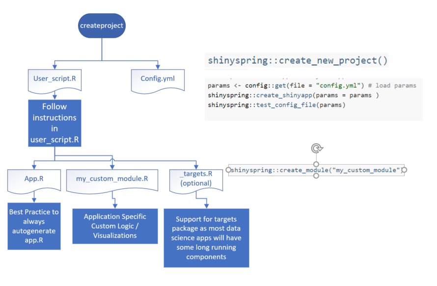

```{r setup, include=FALSE}
knitr::opts_chunk$set(echo = TRUE)
```

### Best Practices for Dashboards

While attending a webinar on Augmented Analytics from Gartner I was surprised to learn that of the clients who say that they had a **successful self service BI tool**(eg: Tableau) implementation, the **adoption rate** among the Business users was **only 14%**.

So, what is wrong here?

### What is the development pattern for Shinyspring ?

Most Insight Apps follow a pattern. The Pattern is

1.  **Load Dataset**
2.  Provide a screen for app tutorial / **users manua**l that explains the functionality of the app
3.  **Core app** : Show persona specific targeted visualizations for the insights for the problem you are working on.
4.  Show **affiliated visualizations** that enable the user for some data exploration in the context of the problem. Standard EDA type visualizations.
5.  for Admins, provide functionality to kick start some jobs (eg: Model Monitoring , Data pulls for productions) and monitor health of application.

Shinyspring provides modules and templates to **wire the application** in an accelerated plug and play manner.

### App Lifecycle

| Diagram       |
|---------------|
|  |
|               |

### Key UI Concepts

-   A ShinyFramework App is an assembly of [shiny modules](https://shiny.rstudio.com/articles/modules.html "ShinyModules"). Some modules built by App developer, but a lot reused from pre-built modules like those from sweetmods
-   Every Menu Tab is a [shiny module](https://shiny.rstudio.com/articles/modules.html "ShinyModules")
-   A YML config file is used to wire the UI . i.e define the menu's , icons , titles , link menu's to modules
-   the Shinyapp (app.R) is auto-generated based on a [whisker/mustache](https://mustache.github.io/mustache.5.html) template and the YML file. Best practice is to never handcode the app.R.

### Key datasets Concepts

-   datasets are configured in config.yml. an example configuration is shown below

-   All datasets are named and reerenced via the `app_master` R6 objects. Example methods

-   datasets are pre-loaded at application start

### What are current modules available ?

### How can I build modules that work with shiynspring ?

### Is Shinyspring robust and production ready ?
